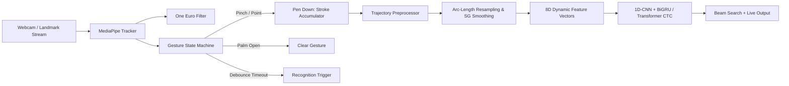

# SkyInk

> **Real-Time Air-Writing Recognition via Fingertip Trajectory Sequence Modeling**

[](https://www.python.org/)
[](https://pytorch.org/)
[](https://developers.google.com/mediapipe)
[](https://fastapi.tiangolo.com/)
[](https://opensource.org/licenses/MIT)

**SkyInk** is a production-grade air-writing recognition system that translates 2D/3D index fingertip trajectories drawn in front of a webcam into digital text in real time (≥25 FPS). Rather than treating air-writing as an image classification task over a static canvas, SkyInk treats writing as a continuous dynamic trajectory sequence.

---

## Architecture Overview



### Core Pipeline
1. **Fingertip Tracking**: MediaPipe Hands tracks landmark 8 (index tip) and landmark 4 (thumb tip).
2. **Adaptive Filtering (1€ Filter)**: Speed-dependent low-pass cutoff eliminates camera tremor during fine strokes while ensuring zero lag during rapid transitions.
3. **Pen-Up / Pen-Down Detection**: Scale-invariant pinch gesture ($d_{\text{thumb-index}} / \text{hand\_scale} < \tau$) with pointing heuristic fallback.
4. **Trajectory Preprocessing**:
   - Equidistant arc-length spatial resampling (uniform point density).
   - Savitzky-Golay stroke smoothing.
   - Translation and scale normalization (aspect-ratio preserving).
   - Dynamic 8D feature extraction: $[x, y, \Delta x, \Delta y, \text{speed}, \sin\theta, \cos\theta, \kappa \text{ (curvature)}]$.
5. **Sequence Modeling**:
   - **Baseline**: 1D-CNN + Bidirectional GRU for single character classification (A-Z, a-z, 0-9).
   - **Continuous**: Transformer Encoder with Connectionist Temporal Classification (CTC) for continuous word recognition.
6. **Inference & UI**: FastAPI WebSocket streaming backend with rich browser canvas overlay and real-time HUD.

---

## Project Structure

```
SkyInk/
├── airscript/                 # Core library (SkyInk engine)
│   ├── core/                  # Tracker, One Euro filter, trajectory models, preprocessor
│   ├── dataset/               # Augmentations, synthetic generator, PyTorch datasets
│   ├── models/                # 1D-CNN + BiGRU, Transformer CTC
│   ├── decoding/              # CTC greedy and beam search decoders
│   ├── server/                # FastAPI application, WebSocket routes, web client
│   └── utils/                 # Configs, logger, utilities
├── configs/                   # YAML configuration files
├── scripts/                   # CLI tools: visualizer, data collector, training, benchmark
├── tests/                     # Unit tests for preprocessing, tracking, dataset, server
├── requirements.txt           # Python dependencies
└── pyproject.toml             # Build system and metadata
```

---

## Quickstart

### 1. Installation
Clone the repository and install dependencies:
```bash
git clone https://github.com/TheekshanaChathuranga/SkyInk.git
cd SkyInk
pip install -r requirements.txt
```

### 2. Live Fingertip Tracking Demo
Run the visualizer with your webcam:
```bash
python scripts/visualize_tracking.py --source 0
```
Or run simulation mode (headless / no webcam):
```bash
python scripts/visualize_tracking.py --demo
```

### 3. Data Collection Web App
Start the data collection server:
```bash
uvicorn airscript.server.app:app --host 0.0.0.0 --port 8000
```
Navigate to:
- **Data Collector**: `http://localhost:8000/collect`
- **Live Recognition**: `http://localhost:8000/`

### 4. Running Unit Tests
```bash
python -m pytest tests/ -v
```

---

## License
MIT License. See [LICENSE](LICENSE) for details.
